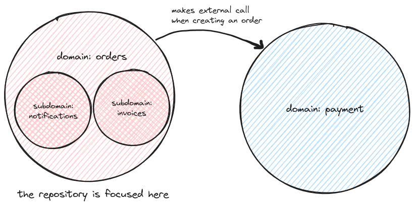

# DDDemo
A minimal example for a scalable, easy-to-maintain Domain Driven Design repository. 

## Summary
This repository features a monolith backend service containing a single module `orders`. The
module contains only one feature: create an order. When a new order is created,
it publishes an `OrderCreated` event which triggers handler executions in the subdomains
that subscribes to that event, i.e. `notifications` and `invoices` services.

## Highlights
- Handling domain events via observer pattern, i.e. `EventPublisher` and
  `EventSubscriber`.
- Vertical slice architecture. The project structure follows the concepts of the
  relevant domains and subdomains, without explicitly using the technical DDD
  terms.
- Grouping side-effects per event (`subscribeOrderCreatedEvents`), enabling a quick
  glance of all side-effects involved from an event.
- Hexagonal architecture. The repository splits the domain and adapter
  implementations following the hexagonal architecture pattern, without
  explicitly using the technical HA terms e.g. no mentions of domains, ports or adapters.
- CQRS (currently only contains a single command.)

## Overview
### Architecture Diagram


### Directories
```
PROJECT_ROOT
├── cmd -------------------------------> monolith app 
│   ├── main.go
│   └── monolith
├── internal/ -------------------------> supporting files for monolith
├── orders
│   ├── internal
│   │   ├── app -----------------------> service app (CQRS style)
│   │   │   ├── app.go
│   │   │   ├── commands/
│   │   │   └── queries/
│   │   ├── orders
│   │   │   ├── event.go --------------> contains domain events
│   │   │   ├── event_handler.go ------> event handler interface for subdomains
│   │   │   ├── handler.go ------------> available order service functions
│   │   │   ├── invoices/ -------------> order subdomain 1
│   │   │   ├── notifications/ --------> order subdomain 2
│   │   │   └── ...
│   │   └── payments/ ------------------> external domain
│   └── module.go ---------------------> service setup. check this first.
└── README.md
```

## Acknowledgements
This project took many inspirations from the project
https://github.com/PacktPublishing/Event-Driven-Architecture-in-Golang, which
provides a more complex example. While the general idea is the same, the
implementation greatly differs. This repository opts for a vertical slice
architecure on top of the DDD pattern, and grouping the domain event subscription per
event rather than per service.
